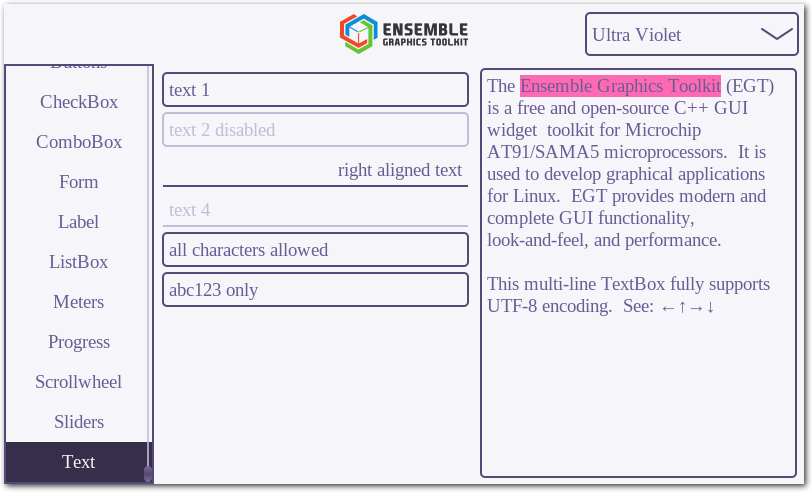

The Ensemble Graphics Toolkit (EGT) is a free and open-source C++ GUI widget
toolkit for Microchip AT91/SAMA5 microprocessors.  It is used to develop
graphical applications for Linux.  EGT provides modern and complete GUI
functionality, look-and-feel, and performance.

Want to help out or make some changes?  See [Contributing](CONTRIBUTING.md).

## Features

- Anti-aliased 2D vector graphics.
- Modern C++11 design and simplicity.
- Optimized for Microchip microprocessors running Linux.
- DRM/KMS, X11, and fbdev backends.
- libinput, tslib, and evdev input support for mouse, keyboard, and touchscreen.
- UTF-8 encoding with internationalization and localization support.
- Support for libplanes and hardware LCD overlay planes.
- Built in and simple animation support for creating custom effects.
- A rich and extensible default widget set designed for embedded touchscreens.
- Multimedia support for video playback, raster images, and vector graphics.
- Customizable look and feel with themeable widget drawing, colors, and fonts.

## Build

Install dependencies.

To build for a PC, first install recommended dependencies:

```sh
sudo apt-get install build-essential automake autoconf libtool pkg-config \
    libdrm-dev libinput-dev libcairo-dev libjpeg-dev libmagic-dev gettext
```

Optional dependencies include:

```sh
sudo apt-get install librsvg2-dev liblua5.3-dev libcurl4-openssl-dev \
     libxkbcommon-dev xkb-data libgstreamer1.0-dev libgstreamer-plugins-base1.0-dev
sudo apt-get install libgstreamer1.0-dev libgstreamer-plugins-base1.0-dev
```

Then clone the source and build.

```sh
git clone --recursive https://github.com/linux4sam/egt.git
cd egt
./autogen.sh
./configure
make
make install
```

## Example

The obligatory complete EGT application that can be compiled and run.  It shows
creating the Application object, and then a Window and a Button on the screen.

```cpp
#include <egt/ui>

int main(int argc, const char** argv)
{
    egt::Application app(argc, argv);

    egt::TopWindow window;
    egt::Button button(window, "Press Me");
    egt::center(button);
    window.show();

    return app.run();
}
```

To link this example application, saved as example.cpp, use pkgconfig.

```sh
g++ -std=c++11 example.cpp -o example `pkg-config libegt --cflags --libs` -pthread
```

Then, run.

```sh
./example
```

## Screenshots




## Dependencies

*Recommended:*

- libplanes >= 1.0.0
- libdrm >= 2.4.0
- cJSON >= 1.6.0
- lua >= 5.3.1
- cairo >= 1.14.6
- tslib >= 1.15
- gstreamer >= 1.12
- libjpeg
- rapidxml
- libinput >= 1.8.2
- libmagic

*Optional:*

- x11
- lua
- libjpeg
- libcurl
- librsvg


## License

EGT is released under the terms of the `Apache 2` license. See the [COPYING](COPYING)
file for more information.
